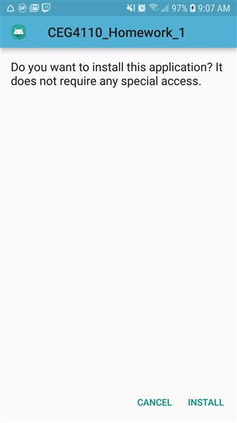

# CEG 4110 : Homework 1

### Introduction

This project implements two pieces of functionality on an android device:
1. A random color generator
* User can type in text and text will change to the random color generated
2. A canvas for drawing
* User can draw on the canvas, clear it, and save the canvas drawing to their device. Additionally, they are able to select any color they wish to draw with.

---
### External Dependencies
This project has one external dependency. It is a library called AndroidDraw. This library is responsible for the canvas drawing functions. 

The installation for this library is as follows:
1. Goto this github webpage https://github.com/divyanshub024/AndroidDraw
2. Add the JitPack repository to your build file in your root gradle file
* 
3. Add the dependency to the library in your your apps gradle file. This will be different from the gradle file from part 2. 
* 

Now you're all set! You can now use all the DrawView object included with this library. For more information on how the 
library's github page.

---
### Setting up the Project
To deploy the app to your device follow these instructions:
1. Move the Homework1.apk executable to your mobile device
2. Open the .apk file
3. Allow access to unknown apps

4. Install the executable 

You now how the app installed on your device. Go to your device's application listing and launch the app.

### Using the Project
This app has two main modules of functionality.
1. Text Color Generator
2. Drawing canvas

##### Text Color Generator
1. To navigate to the the color generator, 
select "Part 1: Color Generator"

2. You will now be greeted with a screen that allows you to enter in text

3. Enter in text where the text-box reads "Enter text here" and click the button that reads "CHANGE COLOR".

4. You will now see that the text has changed its color and some information about the current color of the text is displayed. Each button press will generate a random color.

#### Drawing Canvas
1. To navigate to the the drawing canvas, 
select "Part 2: Drawing Canvas"

2. Now you will be greeted wit ha drawing canvas. Press your finger against the screen to draw with it. 

3. You can change the color of your paint by clicking the button "CHANGE COLOR". You will be brought to a new screen which allows you to manually input the color you wish.

4. Press the back button to go back to the main drawing canvas. You can also select "SAVE" to save you drawing. Note: Your picture will save in your device's default photo directory. It should be view-able from your device's default picture gallery.

5. You can also clear the canvas screen by clicking on "CLEAR". Be careful though, there isn't an undo button!

### Closing Thoughts
You can reach me at bforeman7777@gmail.com.
