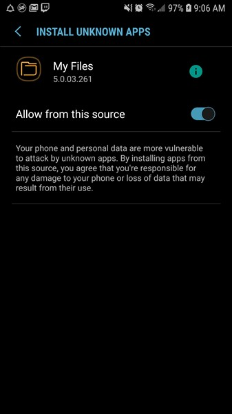
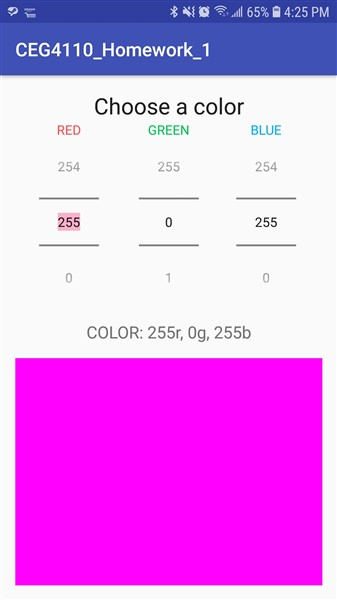

# CEG 4110 : Homework 1

### Introduction

This project implements two pieces of functionality on an android device:
1. A Random Text Color Changer
* User can type in text into a text field. By clicking a button, the color of the text will change to a new randomly generated color. The current color value generated is also displayed in HTML color format.
2. A canvas for drawing
* User can draw on a canvas by touching their screen. They can change the color that they wish to draw with by using a red, green, blue color picker. Additionally, they can clear the screen and save their drawing to a .jpeg file. Their saved image will be in their devices default picture directory (this will most likely where pictures taken by the camera are stored).

---
### External Dependencies
This project has one external dependency. It is a library called AndroidDraw. This library is responsible for the canvas drawing functions. 

The installation for this library is as follows:
1. Goto this github webpage https://github.com/divyanshub024/AndroidDraw
2. Add the JitPack repository to your build file in your root gradle file
3. Add the dependency to the library in your apps gradle file. This will be different from the gradle file from part 2. 
   
Now you're all set! You can now use all the DrawView object included with this library. For more information on how the library's github page in step one.

---
### Setting up the Project
| To deploy the app to your device, follow these instructions:  |
| :----------------------------------------------------------- |
| 1. Move the Homework1.apk executable to your mobile device by any method |
| 2. Open and run the Homework1.apk by clicking on it          |
| 3. Allow access to unknown apps in your settings             |
|                              |
| 4. Install the application                                   |
|                              |
| 5. Go into your application settings and find "CEG4110_Homework_1" |
|                                    |
| 6. Now click on Permissions and tick the button to allow storage permissions. **If you don't enable this permission, then you will be unable to save your drawings** |
|                                    |

---

### Using the Application
This app has two main modules of functionality.
1. Text Color Generator
2. Drawing canvas

| 1. Text Color Generator                                      |
| ------------------------------------------------------------ |
| 1. To navigate to the the color generator, select "Part 1: Color Generator" |
|                                   |
| 2. You will now be greeted with a screen that allows you to enter in text |
|                                   |
| 3. Enter in text where the text-box reads "Enter text here" and click the button that reads "CHANGE COLOR". |
|                                   |
| 4. You will now see that the text has changed its color and information about the current color of the text is displayed. Each button press will generate a random color. |

---

| 2. Drawing Canvas                                            |
| ------------------------------------------------------------ |
| 1. To navigate to the the drawing canvas, select "Part 2: Drawing Canvas". Remember, pressing the back button on your android device will take you back to the previous screen that you are on. |
|                                   |
| 2. Now you will be greeted with a drawing canvas. Press your finger against the screen to draw on it. |
|                                   |
| 3. You can change the color of your paint by clicking the button "CHANGE COLOR". You will be brought to a new screen which allows you to manually input the color you wish. Once you have selected your color, press the back button on your device. |
|                                   |
| 4. Draw with your new color and when you are finished with your drawing  select "SAVE" to save you drawing. Note: Your picture will save in your device's default photo directory. (Your default directory is most likely where your pictures taken by your camera are stored.) It should be view-able from your device's default picture gallery application. (If you don't see your photo there, then you can always view your default picture directory by navigating to if from a file explorer application.) |
|                                   |
| 5. You can also clear the canvas screen by clicking on "CLEAR". Be careful though, there isn't an undo button! |
|                                   |

---

### Design Decisions and Class Structure
This project contains four classes:
* MainActivity
* ColorGeneratorActivity
* CanvasActivity
* ColorPickerActivity

##### MainActivity
This is the initial entry point for the application. MainActivity houses two buttons which act as the main menu where the user can select whether they want to go the ColorGeneratorActivity or CanvasActivity. If either of the buttons are selected, then the activity that corresponds to the button will be started. For example, if ColorGeneratorActivity is selected, then a child activity will be created, and the view will not be ColorGeneratorActivity. This class doesn't directly affect the functionality of the additional classes. It acts only as a driver for the application and therefore it stands on its own.

##### ColorGeneratorActivity
	Another class which is quite simple in terms of the code and functionality. This class is similar in structure to the MainActivity. Though, it is responsible for generating the color that the text will be set to. It handles a single button click and text field input. This module is different in functionality to that of the MainActivity. Although the structure is similar, the functionality is not. It is for this reason, ColorGeneratorActivity is its own class, rather than being part of MainAcitivity. 
##### CanvasActivity
	The 10,000-foot overview of this class shows us three main functions it is responsible for. The user should be able to draw on the canvas, clear the canvas, and save the canvas. This is yet again, another class which has no business being in the MainActivity. This module’s functions are different than that of MainActivity and that is why it is its own separate class. 
Let's start with how drawing on the canvas works. The view needs to allow the user to draw. Now I spent some time looking around and opted for using an open source library which has an object called DrawView. The library allows for changing of the color and thickness of the stroke (current user selected color they will draw with), clearing of the DrawView, and drawing to the DrawView. CanvasActivity has a local variable called drawView which is an instance of DrawView. This is the same object acquired through the open source library. Now for CanvasActivity to allow to user to draw, it needs to interact with the DrawView object by calling its internal member functions i.e. "drawView.clear();" or "drawView.draw();". This is how I handle the different operations that must be performed for the user to draw. However, one limitation of the library is that it doesn't have a built-in saving feature for the picture drawn on the drawView.
	This is where CanvasActivity converts the DrawView to a a bitmap and compressed it to a .jpeg. The saving feature uses the compressed bitmap and outputs the image through a file output stream and saves the image to the android device's default image directory. 
	Now color picking is something that I didn't believe to be associated with the actual CanvasActivity class. After all, this class is responsible for drawing. It is not responsible for allowing the user to change the color of the stroke. I decided to break the color picking functionality off into a separate class dedicated to just picking the color. Before I talk about the ColorPickerActivity, there were some important design decisions that came into play given that I have two class that must both use color.
	The CanvasActivity is not responsible for picking the color, but it does hold the user selected color. It also sends the most recently picked user color to ColorPickerActivity. The class also expects ColorPickerActivity to send the selected color back so that the stroke color can be set.

##### ColorPickerActivity
	This class allows the user to select a red, green, and blue color value. More importantly, it relays this information back to CanvasActivity to allow the user to draw in a different color. I wanted the user to be able to see their selected color update immediately. I achieved this functionality by using an image view which is set the current color selected by the user. 
	I chose to break this class out of CanvasActivity for one major reason, reusability. Obviously, this project would work just fine if ColorPickerActivity were built into CanvasActivity. However, it is important to look at the software classes from the perspective of future use and ease of reusability. In theory, this application could have more than just two parts of major functionality. There could be another piece of functionality which could require the user to select a color. If I opt to not have a ColorPickerActivity and my color picking code is written in my CanvasActivity class, then I need to replicate that code in this new theoretical class. Although, if ColorPickerActivity is its own separate class, then I could simply have the theoretical class just create a new instance of ColorPickerActivity.
	 This is good for two reasons. One, I lessen my risk of bugs in my code base since all the color picking functionality is in one place instead of spreading out across the code base. Two, it means that I can continue to reuse my ColorPickerActivity for any other pieces of functionality which also require the same color picking functionality.
---
### Closing Thoughts
You can reach me at bforeman7777@gmail.com.
